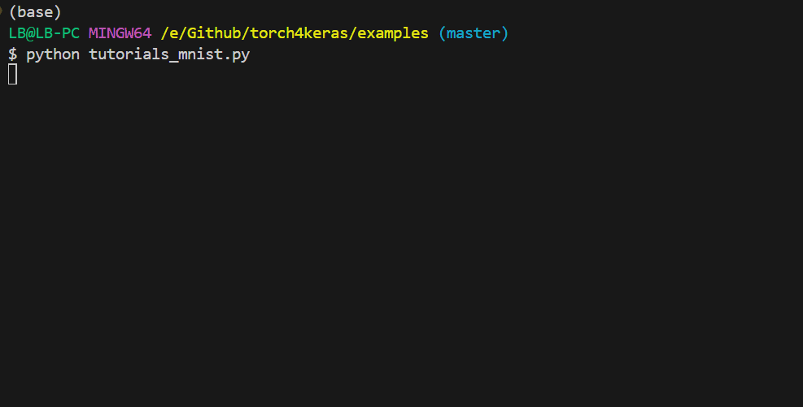

[](https://github.com/Tongjilibo/torch4keras/blob/master/LICENSE)
[](https://github.com/Tongjilibo/torch4keras/releases)
[](https://pypi.org/project/torch4keras/)
[](https://pypistats.org/packages/torch4keras)
[](https://github.com/Tongjilibo/torch4keras)
[](https://github.com/Tongjilibo/torch4keras/issues)
[](https://github.com/Tongjilibo/torch4keras/issues)

[Documentation](https://torch4keras.readthedocs.io) |
[Bert4torch](https://github.com/Tongjilibo/bert4torch) |
[Examples](https://github.com/Tongjilibo/torch4keras/blob/master/examples) |
[Source code](https://github.com/Tongjilibo/torch4keras) |
[build_MiniLLM_from_scratch](https://github.com/Tongjilibo/build_MiniLLM_from_scratch)

## 1. 下载安装

安装稳定版

```shell
pip install torch4keras
```

安装最新版

```shell
pip install git+https://github.com/Tongjilibo/torch4keras.git
```

## 2. 功能

- 简述：抽象出来的Trainer，适用于一般神经网络的训练，仅需关注网络结构代码
- 特色：进度条展示训练过程，自定义metric，自带Evaluator, Checkpoint, Tensorboard, Logger等Callback，也可自定义Callback
- 初衷：前期功能是作为[bert4torch](https://github.com/Tongjilibo/bert4torch)和[rec4torch](https://github.com/Tongjilibo/rec4torch)的Trainer
- 训练：

  

## 3. 快速上手

- 参考[bert4torch](https://github.com/Tongjilibo/bert4torch)的训练过程
- 简单示例: [turorials_mnist](https://github.com/Tongjilibo/torch4keras/blob/master/examples/turorials_mnist.py)

## 4. 版本历史

| 更新日期 | 版本         | 版本说明                                                                                                            |
| -------- | ------------ | ------------------------------------------------------------------------------------------------------------------- |
| 20250925 | v0.3.2       | 增加常见 `shell`命令                                                                                              |
| 20250721 | v0.3.1       | add `cache_text`, `try_except`, `TryExcept`, 完善耗时计算，修改 `load_checkpoint`，增加 `green`等颜色函数 |
| 20250615 | v0.3.0       | 增加 `safe_torch_load`和 `safe_import`                                                                          |
| 20250511 | v0.2.9.post2 | trainer增加kwargs                                                                                                   |
| 20250401 | v0.2.9       | 更新torch.amp                                                                                                       |
| 20250211 | v0.2.8       | 屏蔽torch.load警告, Timeit提示                                                                                      |
| 20240928 | v0.2.7       | 修改ddp的init_process_group;增加一些available函数,增加get_max_memory;DottableDict支持.赋值和嵌套;增加cachedict      |
| 20240814 | v0.2.6       | 小修改(增加check_url_available_cached, 修复Timeit)                                                                  |
| 20240730 | v0.2.5       | 小修改(print_table允许中文, 未安装torch时候仅提醒一次)                                                              |

[更多版本](https://github.com/Tongjilibo/torch4keras/blob/master/docs/Update.md)

## 5. 更新历史：

[更多历史](https://github.com/Tongjilibo/torch4keras/blob/master/docs/History.md)
